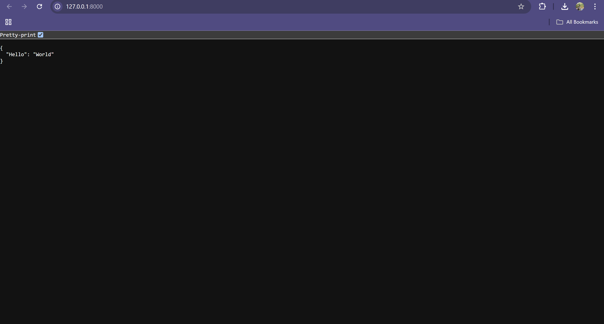
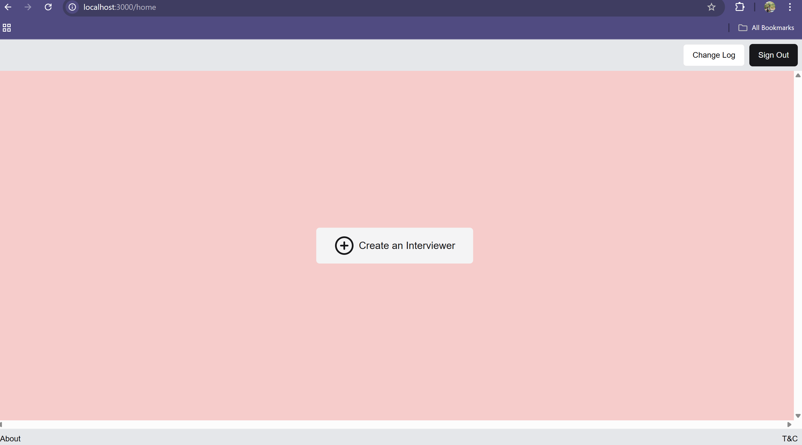
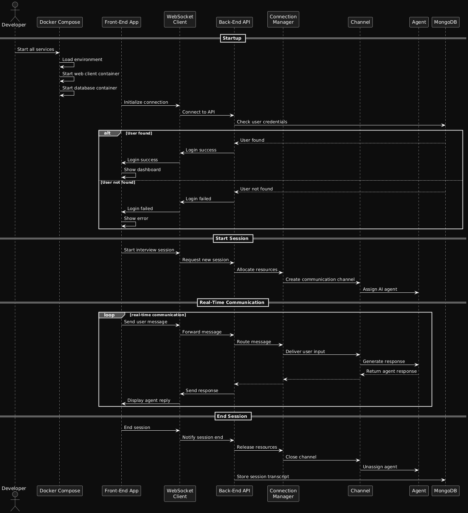
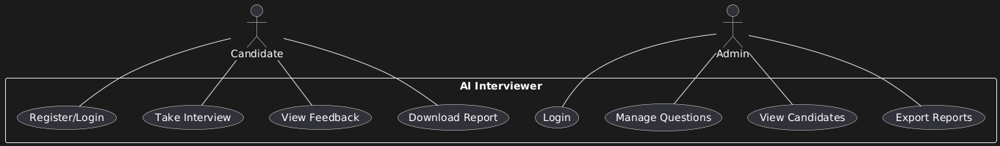

## Rough work

<div align="center">
  
</div>


<!-- # AI Interviewer

**AI Interviewer** is a full-stack, open-source platform that uses AI to conduct, score, and analyze technical interviews. It features an interactive web interface, real-time feedback, and support for multiple question types (coding, MCQ, system design, etc). Both the frontend and backend are containerized for easy deployment.

---

## How to Run Locally

This project consists of a backend (FastAPI + MongoDB) and a frontend (Next.js).  
Follow the steps below to run both **locally** on your machine.

---

### 1. **Clone the Repository**

```
git clone https://github.com/your-username/ai-interviewer.git
cd ai-interviewer
```

---

### 2. **Backend Setup**

#### a. **Install Python & MongoDB**

- Make sure you have **Python 3.11+** and **MongoDB** installed and running locally.
  - [Download MongoDB](https://www.mongodb.com/try/download/community)
  - Start MongoDB (`mongod`)

#### b. **Create and Activate Virtual Environment**

```
cd backend
python -m venv .venv
# Windows:
.venv\Scripts\activate
# macOS/Linux:
source .venv/bin/activate
```

#### c. **Install Dependencies**

```
pip install -r requirements.txt
```

#### d. **Configure Environment Variables**

- Copy `.env.example` to `.env` and fill in the required secrets:
  - `OPENAI_API_KEY`
  - `STRIPE_API_KEY`
  - `MONGO_URI` (use `mongodb://localhost:27017/ai_interviewer`)
  - `MONGO_DB_NAME`
  - `FIREBASE_ADMIN_CREDENTIALS`
- Make sure any referenced secret JSON files exist (e.g., `secrets/firebase-admin-key.json`).

#### e. **Start the Backend**

```
uvicorn main:app --reload
```
- The backend should now be running at [http://localhost:8000](http://localhost:8000).

### Backend page
<div align="center">
  
</div>

---

### 3. **Frontend Setup**

#### a. **Install Node.js**

- Make sure you have **Node.js 18+** and **npm** installed.

#### b. **Install Dependencies**

```
cd frontend
npm install
```

#### c. **Configure Environment Variables**

- Copy `.env.example` to `.env` and update the API endpoint if needed.

#### d. **Start the Frontend**

```
npm run dev
```
- The frontend will run at [http://localhost:3000](http://localhost:3000).

### Frontend page
<div align="center">
  
</div>

---

## Features

- **AI-Powered Interviewer:** Conducts interviews, asks follow-ups, and provides feedback like a human interviewer
- **Multi-Modal Questions:** Coding, MCQ, system design, behavioral
- **Real-Time Evaluation:** Instant scoring, analytics, and feedback
- **User Authentication:** Google/GitHub OAuth
- **Admin Dashboard:** Manage questions, view candidates, export reports
- **Rich Interview Reports:** Downloadable and shareable feedback
- **OpenAI Integration:** Uses GPT models for dynamic questioning and evaluation
- **Secure & Scalable:** Dockerized, supports deployment to cloud or local environments

---

### Sequence diagram
<div align="center">
  
</div>

## Tech Stack

### Frontend

- **Next.js** (React, TypeScript, SSR)
- **Tailwind CSS**
- **Radix UI**
- **Firebase Auth**
- **WebSocket** (real-time backend comms)

### Backend

- **FastAPI** (Python, async)
- **MongoDB** (Beanie ODM)
- **OpenAI API**
- **Firebase Admin SDK**
- **WebSocket Streaming**
- **Dockerized**

---

### Usecase diagram
<div align="center">
  
</div>


### High level sequence diagram
<div align="center">
  
</div>

### Activity diagram
<div align="center">
  
</div>

### 1. Clone & Set Up with Docker

```
git clone https://github.com/Sidebrain/ai-interviewer.git
cd ai-interviewer
```

### 2. Environment Variables

Copy the sample env files and fill in your credentials:

```
cp backend/.env.template backend/.env
cp frontend/.env.docker.template frontend/.env.docker
```
Edit the new `.env` and `.env.docker` files with your API keys and connection info.

### 3. Run with Docker Compose

```
docker compose up --build
```

The frontend will be at `http://localhost:3000` and backend at `http://localhost:8080` (by default).

---

## .env Example (Backend)

```
OPENAI_API_KEY=sk-...
STRIPE_API_KEY=sk-...
CLIENT_URL=http://localhost:3000
MONGO_URI=mongodb://localhost:27017
MONGO_DB_NAME=ai_interviewer
FIREBASE_ADMIN_CREDENTIALS=./secrets/firebase-admin-key.json
```

## .env.docker Example (Frontend)

```
NEXT_PUBLIC_WS_URL=ws://localhost:8000/api/v1/websocket/ws
NEXT_PUBLIC_WS_URL_V2=ws://localhost:8000/api/v2/websocket/ws
NEXT_PUBLIC_WS_URL_V3=ws://localhost:8000/api/v3/websocket/ws
NEXT_PUBLIC_CLIENT_LOG_LEVEL=info
BACKEND_URL=http://localhost:8000
``` -->

